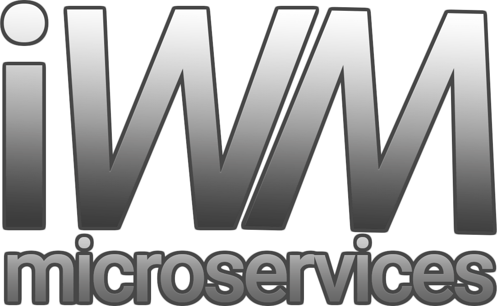

    

# IWM Project - Distributed Minecraft Server Core

## Core Concept

IWM (Infinite World Manager) is a high-performance distributed Minecraft server core built with Rust and Tokio, designed to handle massive concurrency with thousands of simultaneous players. The system represents a modern approach to Minecraft server architecture, leveraging Rust's memory safety guarantees and Tokio's async runtime for optimal performance.

## Technical Architecture

The project implements a multi-service distributed architecture with three primary components:

### 1. IO Service
Handles network communication and connection management using WebSocket protocols for client-server interaction.

### 2. Worker Service
Processes game logic, player movements, and world interactions in a highly concurrent environment.

### 3. Storage Service
Manages persistent data storage for player information, world chunks, and game state.

All services communicate via gRPC with Protocol Buffer serialization for efficient binary communication, enabling low-latency distributed processing.

## Concurrency Architecture

### Shared Resource Management
The system implements a sophisticated custom locking mechanism for shared game resources, specifically world chunks:

- **Mutex-Based Coordination**: Uses `std::sync::Mutex` for thread-safe access to shared world state
- **Resource Coordination Logic**: Implements distributed resource locking to prevent race conditions when multiple workers access the same world chunk
- **Lock Granularity**: Fine-grained locking strategies to minimize contention while maintaining data consistency

### Async Concurrency Model
- **Tokio Runtime**: Leverages Tokio's multi-threaded runtime for handling thousands of concurrent connections
- **Zero-Cost Abstractions**: Rust's async/await syntax with minimal overhead for concurrent operations
- **Task Coordination**: Efficient task scheduling and resource allocation across worker threads

## Low-Level Implementation Details

### Protocol Reverse Engineering
The system includes extensive low-level protocol analysis:

- **Wireshark Integration**: Network traffic analysis to reverse-engineer Minecraft's TCP protocols
- **Manual Byte Stream Parsing**: Direct TCP byte stream manipulation for protocol compatibility
- **Binary Protocol Handling**: Custom binary format parsing for efficient data transmission

### Memory Safety & Performance
- **Zero-Cost Abstractions**: Rust's compile-time guarantees ensure no runtime overhead
- **Memory Safety**: Complete absence of memory corruption issues through Rust's ownership system
- **Low Latency**: Optimized for sub-millisecond response times in high-concurrency scenarios

## Performance Characteristics

### System Optimization
- **Memory Efficiency**: Zero-copy operations where possible, minimal heap allocations
- **Cache-Friendly Design**: Optimized data structures for CPU cache locality
- **Scalable Concurrency**: Horizontal scaling capabilities for massive player counts

### Latency Characteristics
- **Sub-Millisecond Response Times**: Optimized for real-time gameplay
- **Network Efficiency**: Binary protocol communication reduces bandwidth usage
- **Resource Contention Minimization**: Custom locking strategies reduce blocking scenario

### Prerequisites
- Rust 1.70+ (stable channel recommended)
- Cargo package manager
- OpenSSL development libraries (for TLS support)
